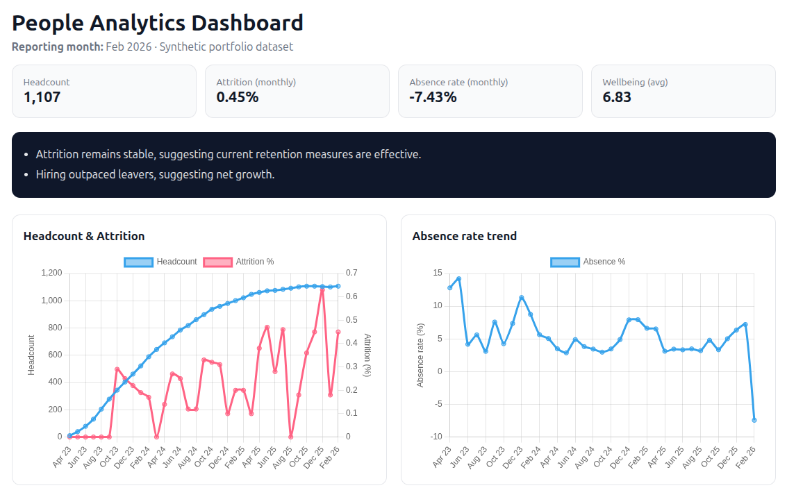
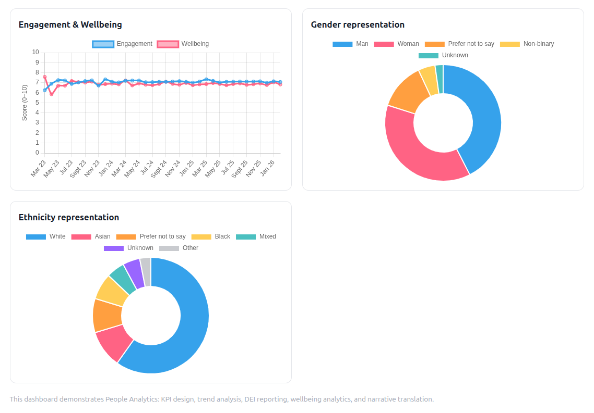

# mined-records-hr-data-analytics-platform
People Analytics &amp; Workforce Insights Platform A live analytics project demonstrating how HR data can be transformed into leadership-ready insight across retention, absence, DEI, and wellbeing.

# People Analytics & Workforce Insights Platform

A live people analytics project demonstrating how HR data can be transformed into **clear, decision-ready insight** for HR teams and organisational leaders.

This platform uses a fully **synthetic but realistic workforce dataset** to replicate real-world people analytics challenges while remaining privacy-safe and portfolio-appropriate.

---

## Overview

The project showcases an end-to-end people analytics workflow:

- Designing HR-relevant metrics
- Analysing workforce trends over time
- Translating data into narratives leaders can act on
- Presenting insight via a live, interactive dashboard

It is intentionally designed to mirror how people analytics operates in practice rather than as a one-off analysis exercise.

---

## Live dashboard

🔗 **Live demo:**  
https://www.minedrecords.com/hr_dashboard.php  

*(All data shown is synthetic and for demonstration purposes only.)*

---

## What this project demonstrates

### Workforce dashboards
- Headcount and workforce growth
- Monthly attrition rates
- Sickness absence rates
- Engagement and wellbeing indicators

### Trend analysis
- Retention and attrition over time
- Sickness absence patterns and long-term absence signals
- Engagement and wellbeing stability vs pressure points

### DEI reporting
- Gender representation
- Ethnicity representation
- Time-based snapshots suitable for leadership reporting

### Narrative translation
Each dashboard view includes automated, HR-focused commentary that highlights:
- Stability vs emerging risk
- Areas that may warrant intervention
- Where further investigation may be required

This reflects the real role of people analytics: **supporting better decisions, not just reporting numbers**.

---

## Screenshots

### Workforce & absence analytics

### DEI representation

---

## Architecture

Synthetic HR dataset  
→ Python data generation & ingestion  
→ MySQL relational data model  
→ SQL analytics views  
→ PHP dashboard  
→ Chart.js visualisations + narrative layer

The platform is deliberately lightweight and cost-efficient, demonstrating how meaningful people analytics can be delivered without complex enterprise tooling.

---

## Data model highlights

- **Employee master table** with privacy-safe attributes
- **Assignment history** to support movement, tenure, and organisational change
- **Absence events** for frequency, duration, and long-term analysis
- **Monthly workforce snapshots** for fast trend reporting
- **Engagement & wellbeing pulses** to support qualitative insight

All metrics are derived via SQL views to ensure transparency, consistency, and reproducibility.

---

## Why this matters commercially

Organisations increasingly rely on people analytics to:
- Reduce unwanted attrition
- Identify wellbeing and absence risks early
- Monitor DEI progress over time
- Support defensible, evidence-based people decisions

This project demonstrates how people analytics can be delivered in a way that is:
- Clear and interpretable for non-technical stakeholders
- Ethically designed with privacy in mind
- Focused on insight rather than raw reporting

---

## Tech stack

- **Python** – synthetic data generation & loading
- **MySQL** – relational storage and analytics
- **SQL views** – KPI and trend derivation
- **PHP** – dashboard layer
- **Chart.js** – interactive visualisation

---

## Notes

This project is intended as a **portfolio demonstration** aligned to roles in:
- People Analytics
- Workforce Analytics
- HR Data & Insight
- Evidence-based organisational decision support

---

## Author

**Magnus Irvine**  
People Analytics • Data Engineering • Insight & Reporting
